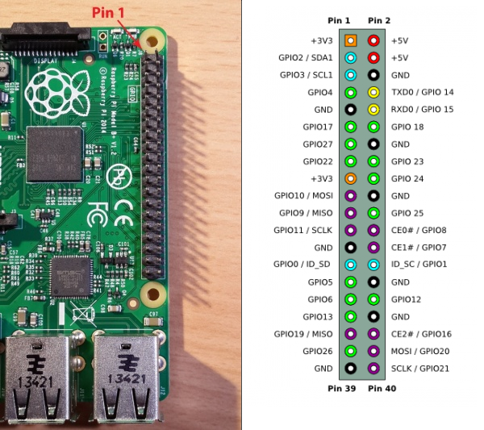
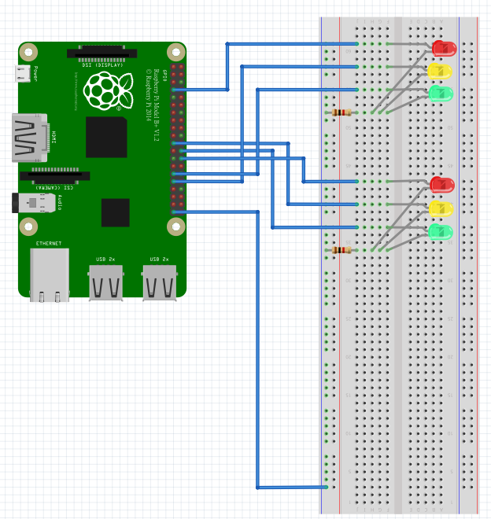
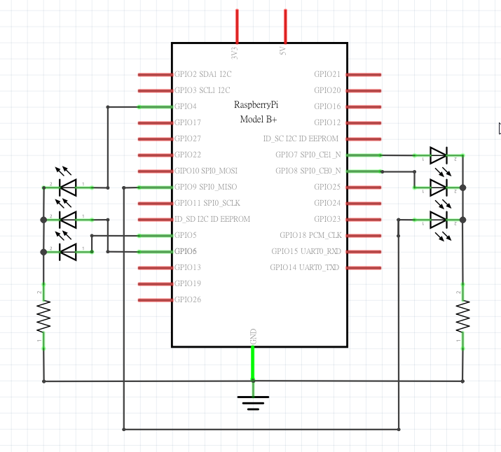
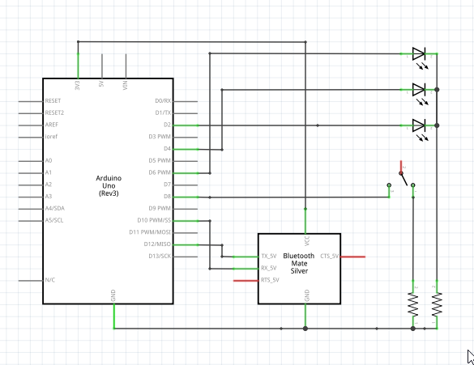

# Raspberry Pi + Arduino + iBeacon = 畢業專題
透過 Raspberry Pi 發出 ibeacon 廣播的交通號誌，並且可以用網頁控制開關與參數設定，再以 Arduino + HM-10 晶片接收廣播將當前號誌輸出至LED

## 導覽

- [材料](#material) 
- [參考資料](#ref) 

### Raspberry Pi

- [Raspberry Pi : 安裝與設定 RVM](#pi-1)  
- [Raspberry Pi : 使用藍芽 Dongle 與安裝 BlueZ](#pi-2)  
- [Raspberry Pi : 說明 ibeacon.rb](#pi-3)  
- [Raspberry Pi : 說明 config.rb 與 config.json](#pi-4)  
- [Raspberry Pi : 安裝 Pi_piper](#pi-5)  
- [Raspberry Pi : 說明 RYG.rb](#pi-6)  
- [Raspberry Pi : 說明 GPIO 與 LED 線路](#pi-7)  
- [Raspberry Pi : 安裝 Sinatra 與 app.rb](#pi-8)  
- [Raspberry Pi : 安裝與設定 Passenger](#pi-9)  
- [Raspberry Pi : 設定 Apache](#pi-10)  

### Arduino

- [Arduino : 說明硬體線路](#arduino-1)  
- [Arduino : 說明主程式](#arduino-2)  


## <a name="material"></a>材料

1. Raspberry Pi 2 Model B
    1. microSD 16GB
    2. WiFi USB Dongle
    3. Bluetooth4.0 USB Dongle
    4. 紅綠黃LED各一
    5. 10k電阻三個
2. Arduino Uno
    1. HM-10
    2. 紅綠黃LED各1
    3. 10k電阻3個
3. 其他
    1. 線材
    2. 行動電源2個 

## Raspberry Pi

### 安裝 Raspbian 作業系統

參考 [http://www.botsheet.com/cht/raspberry-pi-tutorial-install-raspbian-windows/](http://www.botsheet.com/cht/raspberry-pi-tutorial-install-raspbian-windows/)

### <a name="pi-1"></a>安裝與設定 Ruby RVM

參考 rvm 官網 : [https://rvm.io/](https://rvm.io/)

#### Install RVM :

```sh
$ sudo apt-get update
$ sudo apt-get upgrade
$ gpg --keyserver hkp://keys.gnupg.net --recv-keys \
$ 409B6B1796C275462A1703113804BB82D39DC0E3
$ \curl -sSL https://get.rvm.io | bash -s stable
```

成功後重開終端機

#### Install Ruby 2.3 with RVM :

```sh
$ rvm install 2.3
```
會有點久，還要等下載的Ruby編譯，在 Pi 這種效能不高的微電腦上可能需要1個小時,成功後重開終端機
將 RVM 的 Ruby 2.3 設為預設使用的 Ruby

```sh
$ rvm use 2.3 --default
```

再次重開終端機，完成!

### <a name="pi-2"></a>藍芽 dongle 與安裝 BlueZ

#### BlueZ

官方 BlueZ 安裝網址：[http://www.bluez.org/download/](http://www.bluez.org/download/)  
>我們使用的版本是 **bluez-5.40**  

下載與解壓縮

~~~sh
$ cd ~
$ wget http://www.kernel.org/pub/linux/bluetooth/bluez-5.40.tar.xz`
$ unxz bluez-5.40.tar.xz && tar xvf bluez-5.40.tar
~~~

安裝 bluez 要求的 lib

~~~sh
$ sudo apt-get update
$ sudo apt-get install -y libusb-dev libdbus-1-dev libglib2.0-dev \
$ libudev-dev libical-dev libreadline-dev
~~~

進入解完壓縮的bluez資料夾，執行安裝前的設定檔

~~~sh
$ cd bluez-5.40
$ ./configure
~~~

產生安裝檔和安裝

~~~sh
$ make
$ sudo make install
~~~

確認安裝是否完成

~~~sh
$ systemctl status bluetooth
~~~    

得到以下結果：

~~~
● bluetooth.service - Bluetooth service
   Loaded: loaded (/lib/systemd/system/bluetooth.service; enabled)
   Active: active (running) since 一 2016-09-26 15:36:03 CST; 2 weeks 1 days ago
     Docs: man:bluetoothd(8)
 Main PID: 379 (bluetoothd)
   Status: "Running"
   CGroup: /system.slice/bluetooth.service
           └─379 /usr/local/libexec/bluetooth/bluetoothd
~~~
  
Active：active 表示藍芽成功啟動

沒啟動的話會像下面這樣：

~~~
● bluetooth.service - Bluetooth service
   Loaded: loaded (/lib/systemd/system/bluetooth.service; enabled)
   Active: inactive (dead) since 二 2016-10-11 23:17:58 CST; 1s ago
     Docs: man:bluetoothd(8)
  Process: 379 ExecStart=/usr/local/libexec/bluetooth/bluetoothd \
  (code=exited, status=0/SUCCESS)
 Main PID: 379 (code=exited, status=0/SUCCESS)
   Status: "Quitting"
~~~

>統整一下藍芽開關的指令

~~~sh
# 查看狀態
$ systemctl status bluetooth

# 啟動
$ sudo systemctl start bluetooth

# 關閉
$ sudo systemctl stop bluetooth

# 重啟
$ sudo systemctl restart bluetooth
~~~

#### 藍芽 dongle

將 Bluetooth4.0 USB Dongle 插上 Pi  
我們使用的是 **SeeHot 嘻哈部落V4.0 藍牙傳輸器(SBD-40)**  
官方網站：[http://www.seehot.com.tw/products-detail.php?id=120](http://www.seehot.com.tw/products-detail.php?id=120)  
購買網站：[http://24h.pchome.com.tw/prod/DGBT33-A74355576](http://24h.pchome.com.tw/prod/DGBT33-A74355576)  

將藍芽Usb插入樹莓派後，確認目前USB裝置啟動：

~~~sh
$ lsusb

# 確認藍牙啟動
$ hciconfig
~~~

會得到下面這些資訊

~~~
hci0:	Type: BR/EDR  Bus: USB
BD Address: 00:15:83:EA:D0:79  ACL MTU: 310:10  SCO MTU: 64:8
DOWN 
RX bytes:742 acl:0 sco:0 events:58 errors:0
TX bytes:1954 acl:0 sco:0 commands:58 errors:0
~~~

可以看到系統已經啟動藍牙裝置，並且命名為 **hci0**

~~~sh
# 啟動 hci0
$ sudo hciconfig hci0 up

# 輸入下列指令來查看更多hciconfig指令
$ hciconfig -h

# 關閉掃描其他裝置的功能
$ sudo hciconfig hci0 noscan

# 啟動 BLE 訊息廣播功能
$ sudo hciconfig hci0 leadv

# 發送 iBeacon 廣播
$ sudo hcitool -i hci0 cmd 0x08 0x0008 1E 02 01 1A 1A FF 4C 00 02 15 \
$ E2 C5 6D B5 DF FB 48 D2 B0 60 D0 F5 A7 10 96 E0 \
$ 00 00 00 00 C8
~~~

封包結構是由 **iBeacon Prefix**(9bytes) + **UUID**(16bytes) + **Major**(2bytes) + **Minor**(2bytes) + **Tx Power**(1byte)

我們試著來解讀剛剛發送的封包內容

~~~sh
$ sudo hcitool -i hci0 cmd 0x08 0x0008 1E 02 01 1A 1A FF 4C 00 02 15 \
E2 C5 6D B5 DF FB 48 D2 B0 60 D0 F5 A7 10 96 E0 \
00 00 \
00 00 \
C8
~~~

- iBeacon固定格式 `02 01 1A 1A FF 4C 00 02 15`  
- UUID : `E2 C5 6D B5 DF FB 48 D2 B0 60 D0 F5 A7 10 96 E0`  
- Major : `00 00`  
- Minor : `00 00`  
- Tx Power : `C8`

再一個例子

~~~sh
$ sudo hcitool -i hci0 cmd 0x08 0x0008 1e 02 01 1a 1a ff 4c 00 02 15 \
aa aa aa aa bb bb cc cc dd dd ee ee ee ee ee ee \
01 00 \
01 00 \
c5
~~~

- iBeacon固定格式 `02 01 1A 1A FF 4C 00 02 15`
- UUID : `aaaaaaaa-bbbb-cccc-dddd-eeeeeeeeeeee`   
- Major : `01 00`
- Minor : `01 00` 
- Tx Power : `c5`


### <a name="pi-3"></a>ibeacon.rb

這支程式內包含了一個 `Ibeacon` Class，能夠藉由傳入的參數設定 ibeacon，並且發出command 啟動/暫停/廣播 ibeacon

#### 類別結構 :

```rb
class Ibeacon
  # 類別初始化
  def initialize
    # 宣告類別實例變數，並且調用 setting method 設定變數值
  end
  # 類別實例變數
  @config       # 以下實例變數的 hash 集合
  @ble_devise   # ble_devise
  @uuid         # uuid
  @major        # major
  @minor        # minor
  @power        # power
  # 類別實例方法
  def start
    # 發出 commands 準備廣播前初始化後開始廣播
  end
  def stop
    # 發出 command 暫停廣播
  end
  def broadcast
    # 發出 command 開始廣播
  end
  def minor=(new_minor)
    # @minor 的 setter
  end
  def setting
    # @config 的 setter
  end
end
```
#### 使用方法 :

在 RYG.rb 中 require 這個類別，建立一個類別實例，傳入初始化所需的 hash 設定，並且在程式內適當的調用它

```rb
ibeacon = Ibeacon.new(my_config)
ibeacon.start
ibeacon.stop
```

### <a name="pi-4"></a>config.rb 與 config.json

#### config.rb 模組結構 :

```rb
# 需要用到 json lib 幫我們解析 json 檔的資料
require "json"
module Config
  # 在此 block 內的成員，會變成模組的共享成員
  class << self             
    # 模組變數
    @path   # 放置要讀取的 json 檔位於電腦的哪個位置但不包含副檔名.json
    @config # 將json檔內的資料以hash存放於此變數
    # 模組方法
    def path(path)
      # @path 的 setter，並且若是找不到 檔名.json
      # 就會呼叫 get_default 方法改尋找 檔名_default.json
    end             
    def reset
      # 將 檔名.json 的內容還原成 檔名_default.json 的內容
    end
    def update
      # 將@config的值寫回 檔名.json 中
    end
    def get
      # @config 的 getter 
      # 如果 @config不存在就使用 get_default 方法的回傳值
    end
    def set(conf)
      # @config 的 setter，只會更新非空字串的值
    end
    private
    def get_default
      # 回傳檔名_default.json的值，若不存在回傳空hash
    end
  end
end
```

#### config.json 資料結構 :

```json
{
  "ble_devise": "hci0",
  "uuid": "fc 00 00 ac e0 00 10 50 00 00 00 00 00 00 00 00",
  "major": "00 01",
  "minor": "00 00",
  "power": "c8",
  "Rs": "10",
  "Gs": "10",
  "Ys": "2"
}
```
- `ble_devise` 哪一個藍芽 devise
- `uuid` ibeacon UUID
- `major` ibeacon Major 
- `minor` ibeacon Minor 
- `power` ibeacon 功率 
- `Rs` 紅燈秒數  
- `Gs` 綠燈秒數
- `Ys` 黃燈秒數

#### 使用方法 :

在 RYG.rb 與 app.rb 中 require 這個模組，使用此模組的第一步，設定要讀取的json檔的path

```rb
# config.json 在 app/config/config.json
# RYG.rb 與 app.rb 在app/下，所以正確的使用方法為
Config.path("./config/config")
Config.get # 可以取得 config.json 的資料內容 hash
```

### <a name="pi-5"></a>安裝 Pi_piper

pi_piper 的 github : [https://github.com/jwhitehorn/pi_piper](https://github.com/jwhitehorn/pi_piper)

pi_piper這支ruby lib，其實是調用 c 的 lib bcm2835 製作而成，bcm2835 可以控制 Pi 的 GPIO

首先先下載 pi_piper gem

```sh
$ gem install pi_piper
```

#### 使用方法 :

```rb
# 在 lights.rb 程式中 require 它
require 'pi_piper'
include PiPiper

# 宣告新的 GPIO pin4
pin4 = PiPiper::Pin.new(:pin => 4, :direction => :out)

# pin4 高電位
pin4.on

# pin4 低電位
pin4.off
```

這裡的 GPIO pin 角位是 Raspberry Pi 的官方 GPIO 角位 ，不是 wiringpi 的角位

### <a name="pi-6"></a>RYG.rb 與 lights.rb

`lights.rb` 這支程式 require 了 `pi_piper` 函式庫，將紅綠黃三燈集合成一組燈號。

`RYG.rb` 這支程式就是我們的專題的核心，require 的函式庫有 `lights`、`config`、`ibeacon`。  

1. 一開始先用 `config.rb` 讀取 `config.json`，取得紅綠黃燈的秒數與把ibeacon所需的參數傳給 `ibeacon.rb`。
2. 進入無窮迴圈，紅綠黃燈輪迴，透過 `lights.rb` 輸出燈號，與對應燈號的 ibeacon minor 值。
3. 捕捉 interrupt 訊號，如果程式被中斷，即將燈號電位歸零，ibeacon廣播終止。


### <a name="pi-7"></a>GPIO 與 LED 線路

Raspberry Pi GPIO 參考圖片:  


Raspberry Pi 麵包版接線圖:  


Raspberry Pi 電路圖:  



### <a name="pi-8"></a>安裝 Sinatra 與 app.rb 

#### 安裝 :
首先先安裝Sinatra

```sh
$ gem install sinatra
```
#### 使用方法 :  
接著在 app.rb 中 require 它

```ruby
require 'sinatra'

get 'some/path' do
    # something
end
```

接著設定我們能夠接受的路由路徑

```rb
get '/' do
end

get '/start' do
end

get '/stop' do
end

get '/restart' do
end

get '/config' do
end

post '/config' do
end

get '/config/default' do
end
```
並在do end中執行當路由匹配時想執行的程式

### <a name="pi-9"></a>安裝與設定 Passenger
#### 安裝Passenger（ 含 Apache ）

~~~sh
$ gem install passenger
$ sudo apt-get update
$ sudo apt-get install libcurl4-openssl-dev
$ sudo apt-get install apache2-mpm-worker
$ sudo apt-get install libapr1-dev
$ sudo apt-get install libaprutil1-dev
$ sudo apt-get install apache2-threaded-dev
$ passenger-install-apache2-module
~~~

跟著提示步驟走即可。

#### 設定Passenger

~~~sh
$ passenger-config about ruby-command
~~~

取得目前使用的ruby command path 等等設定apache會用到

#### 連結 app 與 Passenger 與 Apache

在app path:`/home/pi/Final-Project/app`處新增兩個資料夾`public``tmp`，與一個rackup檔案`config.ru`

~~~sh
$ mkdir public
$ mkdir tmp
$ nano config.ru
~~~

public 資料夾就是 Apache 與 Passenger 與 app 溝通所需的資料夾空間，app網頁中用到的圖片、css、js，也都需要放置在此資料夾內。

`config.ru`內容

~~~ruby 
require "./app.rb"
run Sinatra::Application
~~~

這樣一來 當設定完 Apache ，訪問 pi 的 ip `192.168.1.113` 就能看到我們的 web app 了


### <a name="pi-10"></a>設定 Apache

#### 基礎設定

設定檔放置在`/etc/apache2/apache2.conf`

~~~sh
$ sudo nano /etc/apache2/apache2.conf 
~~~

設定檔內容，把其他Directory註解掉

~~~
LoadModule passenger_module /home/pi/.rvm/gems/ruby-2.3.0/gems/passenger-5.0.30/buildout/apache2/mod_passenge$
<IfModule mod_passenger.c>
    PassengerRoot /home/pi/.rvm/gems/ruby-2.3.0/gems/passenger-5.0.30
    PassengerDefaultRuby /home/pi/.rvm/gems/ruby-2.3.0/wrappers/ruby
</IfModule>

# 把其他Directory註解掉並加上下面內容取代
<VirtualHost *:80>
    ServerName localhost

    # Tell Apache and Passenger where your app's 'public' directory is
    DocumentRoot /home/pi/Final-Project/app/public

    PassengerRuby /home/pi/.rvm/gems/ruby-2.3.0/wrappers/ruby

    # Relax Apache security settings
    <Directory /home/pi/Final-Project/app/public>
      Allow from all
      Options -MultiViews
      # Uncomment this if you're on Apache > 2.4:
      #Require all granted
    </Directory>
</VirtualHost>
~~~

設定完後執行

~~~sh
$ sudo apache2ctl restart
~~~

但是會報錯

~~~
AH00558: apache2: Could not reliably determine the server's fully qualified domain name, using 127.0.0.1. Set the 'ServerName' directive globally to suppress this message
~~~

#### 設定Servername

~~~sh
$ sudo nano /etc/apache2/conf-available/servername.conf
~~~

在`/etc/apache2/conf-available/servername.conf`寫入

~~~
ServerName localhost
~~~

讓apache啟用設定檔

~~~sh
$ sudo a2enconf servername
$ sudo service apache2 reload
~~~

這時候再重啟就不會報錯了

~~~sh
$ sudo apache2ctl restart
~~~


## Arduino

### <a name="arduino-1"></a>硬體接線
麵包版接線圖:  


電路圖:  



### <a name="arduino-2"></a>主程式

1. 透過嵌入在主程式中的 AT Command 查詢附近 iBeacon
2. 操作字元取得iBeacon狀態
3. 條件判斷LED燈亮暗

## <a name="ref"></a>參考資料

- 安裝 Raspbian 作業系統  
[http://www.botsheet.com/cht/raspberry-pi-tutorial-install-raspbian-windows/](http://www.botsheet.com/cht/raspberry-pi-tutorial-install-raspbian-windows/)

- RVM 官網  
[https://rvm.io/](https://rvm.io/)

- SeeHot 嘻哈部落V4.0 藍牙傳輸器(SBD-40)  
官方網站：[http://www.seehot.com.tw/products-detail.php?id=120](http://www.seehot.com.tw/products-detail.php?id=120)  
購買網站：[http://24h.pchome.com.tw/prod/DGBT33-A74355576](http://24h.pchome.com.tw/prod/DGBT33-A74355576)

- Raspberry Pi 發送 iBeacon  
[http://cheng-min-i-taiwan.blogspot.tw/2015/03/raspberry-pi-40ibeacon.html](http://cheng-min-i-taiwan.blogspot.tw/2015/03/raspberry-pi-40ibeacon.html)

- pi_piper 的 github  
[https://github.com/jwhitehorn/pi_piper](https://github.com/jwhitehorn/pi_piper)

- Ruby Process 與 Signal 參考
[https://ruby-doc.org/core-2.3.0/Process.html#method-c-kill](https://ruby-doc.org/core-2.3.0/Process.html#method-c-kill)  
[http://stackoverflow.com/questions/14635318/having-a-io-popen-command-be-killed-when-the-caller-process-is-killed](http://stackoverflow.com/questions/14635318/having-a-io-popen-command-be-killed-when-the-caller-process-is-killed)  
[https://ruby-doc.org/core-2.3.0/Signal.html](https://ruby-doc.org/core-2.3.0/Signal.html)  
[http://ddl1st.iteye.com/blog/1772049](http://ddl1st.iteye.com/blog/1772049)  
[https://ruby-china.org/topics/8089](https://ruby-china.org/topics/8089)  

- Raspberry Pi 設定 Ruby Passenger 與 Apache 參考
[http://recipes.sinatrarb.com/p/deployment/apache_with_passenger?#article](http://recipes.sinatrarb.com/p/deployment/apache_with_passenger?#article)  
[https://www.phusionpassenger.com/library/deploy/apache/deploy/ruby/](https://www.phusionpassenger.com/library/deploy/apache/deploy/ruby/)  
[http://askubuntu.com/questions/256013/could-not-reliably-determine-the-servers-fully-qualified-domain-name](http://askubuntu.com/questions/256013/could-not-reliably-determine-the-servers-fully-qualified-domain-name)  
[http://stackoverflow.com/questions/3371208/how-to-setup-a-sinatra-app-under-apache-with-passenger](http://stackoverflow.com/questions/3371208/how-to-setup-a-sinatra-app-under-apache-with-passenger)

- 繪製電路圖軟體 Fritzing  
[http://fritzing.org/home/](http://fritzing.org/home/)
